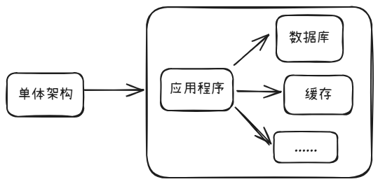
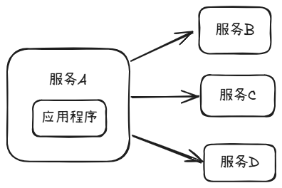
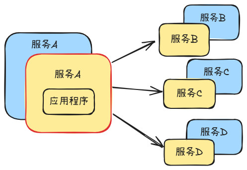
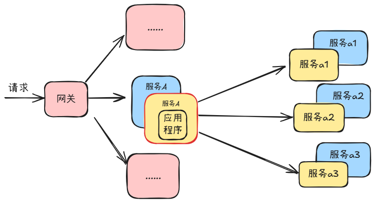
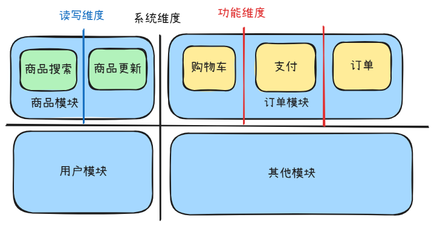
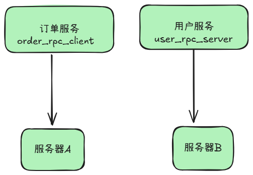
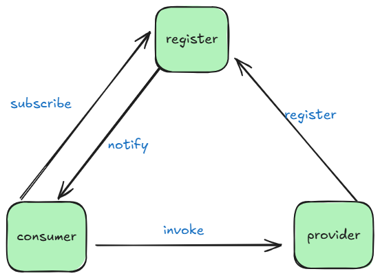
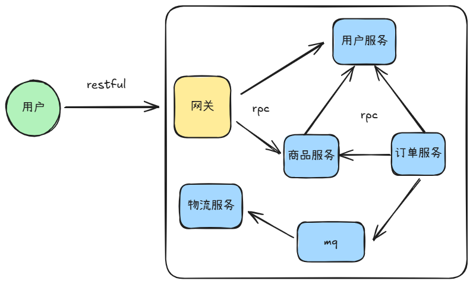
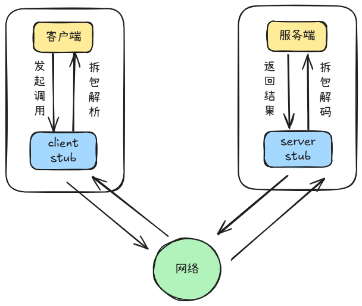

## 微服务基础理论

### 架构演变

#### 单体架构




**单体架构就是数据库，缓存等一系列组件都在一台机器上面**，

单体应用的优点

- **开发效率高**：功能都在单个程序内部，便于软件设计和开发规划。
- **容易部署成本低**：程序单一不存在分布式集群的复杂部署环境，降低了部署难度。
- **容易测试**：没有各种复杂的服务调用关系，都是内部调用方便测试。

单体架构的缺点就是，在数据，缓存，文件等不断增多的情况下，一台服务器资源有限经受不了这种压力，于是就提出了一种分布式的解决方案

#### 分布式设计



这种设计将各个服务都部署到不同的机器上面进行运行，这样各个服务之前不会进行资源的竞争，压力就小了很多，但是在这种情况下面就会出现一个问题：**由于机器部署了多台，每个服务都可能出现宕机的情况，于是提出了集群在保障了基本的高可用。**

#### 集群



我们可以部署一台不同的机器跑相同的服务，再通过合理的负载均衡策略，将请求分散到不同的服务器上面，这样的话就保障了一定的高可用，比如我们有两台机器，如果其中的一台机器挂掉了，另一台机器就可以承担整个请求的任务了。

但是当前的集群也会有一个新的问题的：**比如这里的服务ABC，每个服务的请求量和业务复杂度都是不同的，那么就会出现有一些服务的请求和复杂度特别高，那么我们就会对一些服务进行拆分更微小的服务，降低耦合度，这样就形成了我们的微服务。**

#### 微服务



从单体整个应用程序开始进行拆分，拆分为多个服务，并根据每个服务各自的特点拆分成更微笑的服务，最终就成就了我们的微服务。在微服务前有一个网关，通过负载均衡和nginx反向代理进入我们的网关，通过网关会找到我们相关的服务。

但是微服务也不是万能的，这种架构会增加整个项目的复杂度

### 微服务拆分原则

在服务拆分的时候，是否就一定是拆分得越细越好吗？

当一个项目拆分的时候，拆分的服务越多，从理论上来说它的可维护性也就越好。但是这不是适用于所有团队，拆分得越细，需要得团队人数就越多，项目得复杂度也就越高。

**系统维度拆分：**根据系统**一类功能聚集在一起的模块**进行拆分，系统维度是最基本的拆分单位。

**功能维度拆分：**针对一些**复杂度较高或重要的功能**进行拆分。

**读写维度拆分：**针对数据操作存在**较大读写差的功能或模块**进行拆分。



**AOP维度拆分**：针对**面向切面编程的功能模块**进行拆分

分层维度拆分：根据项目**编码中的分层设计**作为维度进行拆分。

### 微服务通信机制

#### RPC通信机制

RPC是什么，如何实现服务通信

**定义**：是一种用于不同计算机之间通信的协议。它允许一个计算机程序调用另一个计算机上的函数或者方法。

在单体架构中，我们只需要得到这个服务对象就可以调用其方法，但是在服务拆分之后变成了两台机器，就不能这样调用了，那应该怎么办呢？此时我们就有一个意愿，就是在服务拆分之后我们仍然能够像本地那样调用,RPC就诞生了。所以RPC的存在就是把远程的服务调用变得跟本地类似



我们在远程调用的时候会有几个问题

- **我们应该怎么找到目标服务？**

通过IP和端口，IP就是机器的IP地址（如果有域名可以替换成域名），端口就是服务端口（程序）

**在微服务架构中，服务发现（Service Discovery）是动态定位目标服务实例的核心机制**

**服务注册与服务发现**



**provider ： 服务提供者**

**consumer ： 服务消费者**

**register ： 注册中心**

##### 服务注册

每个微服务在启动时，将自己的网络地址等信息（微服务的ServiceName、IP、Port、MetaData等）注册到注册中心如：Consul，etcd等。注册中心存储这些数据。


**定时续期**

定时续期相当于 `keep alive`，定期告诉 `Service Registry` 自己还在，能够继续服务

服务消费者从注册中心查询服务提供者的地址，并通过该地址调用服务提供者的接口。


##### 退出撤销

当进程退出时，我们应该主动去撤销注册信息，便于调用方及时将请求分发到别的节点。同时，go-zero这个微服务框架 通过自适应的负载均衡来保证即使节点退出没有主动注销，也能及时摘除该节点

##### 服务发现

**服务发现的方式一般有两种：**

1、拉取的方式：服务消费方（Consumer）主动向注册中心发起服务查询的请求。

2、推送的方式：服务订阅/通知变更（下发）：服务消费方（Consumer）主动向注册中心订阅某个服务，当注册中心中该服务信息发生变更时，注册中心主动通知消费者。

**健康检查**

主动探测：注册中心定期调用服务的健康检查接口。

心跳机制：服务定期发送心跳包，超时未收到则标记实例为不健康

简单示例

```go
package main

import (
	"context"
	"fmt"
	"time"
	"go.etcd.io/etcd/client/v3"
)

// 服务注册到 etcd
func registerWithEtcd(serviceName, addr string) {
	cli, err := clientv3.New(clientv3.Config{
		Endpoints:   []string{"localhost:2379"},
		DialTimeout: 5 * time.Second,
	})
	if err != nil {
		panic(err)
	}
	defer cli.Close()

	// 创建租约
	leaseResp, err := cli.Grant(context.Background(), 10) // 10秒租约
	if err != nil {
		panic(err)
	}

	// 注册服务
	key := fmt.Sprintf("/services/%s/%s", serviceName, addr)
	_, err = cli.Put(context.Background(), key, addr, clientv3.WithLease(leaseResp.ID))
	if err != nil {
		panic(err)
	}

	// 自动续约保持心跳
	keepAliveCh, err := cli.KeepAlive(context.Background(), leaseResp.ID)
	if err != nil {
		panic(err)
	}

	// 后台续约协程
	go func() {
		for range keepAliveCh {
			// 续约成功
		}
	}()
}

// 服务发现（从 etcd 获取实例列表）
func discoverFromEtcd(serviceName string) []string {
	cli, err := clientv3.New(clientv3.Config{
		Endpoints:   []string{"localhost:2379"},
		DialTimeout: 5 * time.Second,
	})
	if err != nil {
		panic(err)
	}
	defer cli.Close()

	// 查询服务实例
	resp, err := cli.Get(context.Background(), fmt.Sprintf("/services/%s/", serviceName), clientv3.WithPrefix())
	if err != nil {
		panic(err)
	}

	var instances []string
	for _, kv := range resp.Kvs {
		instances = append(instances, string(kv.Value))
	}
	return instances
}

// 示例使用
func main() {
	// 注册服务
	go registerWithEtcd("order-service", "192.168.1.100:8080")

	// 服务发现
	instances := discoverFromEtcd("order-service")
	fmt.Println("Available instances:", instances)
}
```


- **我们的调度目标是什么？**

调用的服务方法比如：userServer中的GetUser方法

- **数据传输用什么协议？**

可以用JSON/xml/binary等等

#### Restful API和消息队列通信



用户将请求发送与网关，网关将用户的请求分发给各个服务，网关与服务之间的通信可以采用RPC，用户在请求网关的时候一般就是用的restful API，即用户采用API访问网关，网关采用RPC的方式访问各个服务。我们也会用消息队列进行服务之间的通信，比如这里物流服务会向订单服务中订阅完成发货的消息，这个就形成了物流服务和订单服务之间的通信。同时这样也降低了物流服务和订单服务和耦合。

**请求流程**



在客户端和服务端之间都会有一个叫存根的东西，这个存根的目的就是去记录，服务端和客户端需要调用的方法，以及方法的参数，方法的相应相关的信息，对于客户来说，这个客户端的存根就是对服务端所定义服务的描述，而服务端的存根来说就是对服务来说是一个接口的约束，客户端调用的时候会先通过存根知道服务有哪一个方法，依照存根的描述编辑好并发起一个调度，再通过内部的调度机制，通过网络传输到服务端，服务端的存根会调服务端具体的方法，服务端完成请求之后，同样会把结果返回，通过服务端的存根最终又通过网络，客户端接收之后进行拆包。

中间会进行数据的格式序列化和反序列化，客户端发送的时候这里会进行序列化，然后在服务端接收的时候会进行反序列化。

### 微服务框架

### Go-zero

go-zero是一个集成了各种工程实践的 web 和 RPC 框架。通过弹性设计保障了大并发服务端的稳定性，经受了充分的实战检验。


[GitHub](https://github.com/zeromicro/go-zero)

[官方文档](https://go-zero.dev/)

### Kitex

Kitex 字节跳动内部的 Golang 微服务 RPC 框架，具有**高性能**、**强可扩展**的特点，在字节内部已广泛使用。如果对微服务性能有要求，又希望定制扩展融入自己的治理体系，Kitex 会是一个不错的选择。

[Github](https://github.com/cloudwego/kitex)

[官方文档](https://www.cloudwego.io/zh/docs/kitex/)


## Kitex示例

idl

```thrift
namespace go common

struct Resp{
    1:i16 code,
    2:string msg,
    3:binary data,
}
```

```thrift
namespace go user

include "common.thrift"

struct RegisterReq {
    1:string username,
    2:string password,
}

struct RegisterResp {
    1:common.Resp resp,
}

service UserService {
    RegisterResp Register(1: RegisterReq req)
}

```


命令行

```shell
go install github.com/cloudwego/kitex/tool/cmd/kitex@latest

kitex -module class11 idl/common.thrift    
kitex -module class11 idl/user.thrift    

kitex -module class11 -service class11 -use kitex_gen idl/user.thrift
```


api

```go
package main

import (
	"class11/kitex_gen/user"
	"class11/kitex_gen/user/userservice"
	"context"
	"net/http"

	"github.com/cloudwego/hertz/pkg/app"
	"github.com/cloudwego/hertz/pkg/app/server"
	"github.com/cloudwego/kitex/client"
)

func main() {
	h := server.New(server.WithHostPorts("0.0.0.0:8191"))

	usercli, _ := userservice.NewClient("user", client.WithHostPorts("127.0.0.1:8888"))

	h.Group("/")
	h.POST("/register", func(c context.Context, ctx *app.RequestContext) {
		resp, err := usercli.Register(c, &user.RegisterReq{
			Username: "admin",
			Password: "123456",
		})
		if err != nil {
			return
		}
		ctx.JSON(http.StatusOK, resp)
	})

	h.Spin()
}

```

rpc

```go
package main

import (
	"class11/kitex_gen/common"
	user "class11/kitex_gen/user"
	"context"
)

// UserServiceImpl implements the last service interface defined in the IDL.
type UserServiceImpl struct{}

// Register implements the UserServiceImpl interface.
func (s *UserServiceImpl) Register(ctx context.Context, req *user.RegisterReq) (resp *user.RegisterResp, err error) {
	// TODO: Your code here...
	resp = &user.RegisterResp{
		Resp: &common.Resp{
			Code: 0,
			Msg:  "ok",
		},
	}
	return
}

```


服务发现

```go
package main

import (
	"class11/kitex_gen/user"
	"class11/kitex_gen/user/userservice"
	"context"
	"log"
	"net/http"

	"github.com/cloudwego/hertz/pkg/app"
	"github.com/cloudwego/hertz/pkg/app/server"
	"github.com/cloudwego/kitex/client"
	etcd "github.com/kitex-contrib/registry-etcd"
)

func main() {
	h := server.New(server.WithHostPorts("0.0.0.0:8191"))

	r, err := etcd.NewEtcdResolver([]string{"127.0.0.1:2379"})
	if err != nil {
		log.Fatal(err)
	}

	usercli, err := userservice.NewClient(
		"userservice",
		client.WithResolver(r))

	h.Group("/")
	h.POST("/register", func(c context.Context, ctx *app.RequestContext) {
		resp, err := usercli.Register(c, &user.RegisterReq{
			Username: "admin",
			Password: "123456",
		})
		if err != nil {
			return
		}
		ctx.JSON(http.StatusOK, resp)
	})

	h.Spin()
}

```

```go
package main

import (
	user "class11/kitex_gen/user/userservice"
	"log"
	"net"

	"github.com/cloudwego/kitex/pkg/rpcinfo"
	"github.com/cloudwego/kitex/server"
	etcd "github.com/kitex-contrib/registry-etcd"
)

func main() {
	r, err := etcd.NewEtcdRegistry([]string{"127.0.0.1:2379"})
	if err != nil {
		log.Fatal(err)
	}

	addr, _ := net.ResolveTCPAddr("tcp", "127.0.0.1:9090")

	svr := user.NewServer(new(UserServiceImpl), server.WithServerBasicInfo(&rpcinfo.EndpointBasicInfo{ServiceName: "userservice"}),
		server.WithServiceAddr(addr),
		server.WithRegistry(r),
	)

	err = svr.Run()

	if err != nil {
		log.Println(err.Error())
	}
}
```


在rpc的服务上下文中，可以定义数据库等

```go
type UserServiceImpl struct {
	DB *gorm.DB
}
```

在main中初始化

```go
svr := user.NewServer(&UserServiceImpl{DB: db})
```


## GoZero示例

idl

```api
// user.api

syntax = "v1"

type (
    // 定义注册接口的请求体
    RegisterReq {
       Username string `json:"username"`
       Password string `json:"password"`
    }
    // 定义登录接口的响应体
    RegisterResp {
       Code int64  `json:"code"`
       Msg  string `json:"msg"`
    }
)

// 定义 HTTP 服务
// 微服务名称为 user，生成的代码目录和配置文件将和 user 值相关
service user {
    // 定义 http.HandleFunc 转换的 go 文件名称及方法
    @handler Register
    // 定义接口
    // 请求方法为 post
    // 路由为 /user/login
    // 请求体为 RegisterReq
    // 响应体为 RegisterResp，响应体必须有 returns 关键字修饰
    post /user/register (RegisterReq) returns (RegisterResp)
}
```

```protobuf
// user.rpc

syntax = "proto3";

package user;

option go_package = "./pb";

message RegisterReq{
    string Username =1;
    string Password =2;
}

message RegisterResp{
}

service User{
  rpc Register(RegisterReq) returns(RegisterResp);
}
```

命令行

```shell
go install github.com/zeromicro/go-zero/tools/goctl@latest
goctl env check --install --verbose
```

定义完成后，我们使用goctl工具生成api和rpc的代码：

在api文件的父目录desc下打开终端执行：

```
goctl api go -api user.api -dir ../  --style=goZero
```

(user.api替换成你的api文件)(../表示生成的代码在desc的父目录下)

在proto文件的父目录desc下打开终端执行：

```
goctl rpc protoc user.proto --go_out=../ --go-grpc_out=../  --zrpc_out=../ --style=goZero
```

(user.proto替换成你的proto文件)(../表示生成的代码在desc的父目录下)

随后刷新一下项目，你会发现多了很多东西：

example ├── etc │ └── example.yaml ├── main.go └── internal ├── config │ └── config.go ├── handler │ ├── xxxhandler.go │ └── xxxhandler.go ├── logic │ └── xxxlogic.go ├── svc │ └── servicecontext.go └── types └── types.go

- example：单个服务目录，一般是某微服务名称
- etc：静态配置文件目录
- main.go：程序启动入口文件
- internal：单个服务内部文件，其可见范围仅限当前服务
- config：静态配置文件对应的结构体声明目录
- handler：handler 目录，可选，一般 http 服务会有这一层做路由管理，`handler` 为固定后缀
- logic：业务目录，所有业务编码文件都存放在这个目录下面，`logic` 为固定后缀
- svc：依赖注入目录，所有 logic 层需要用到的依赖都要在这里进行显式注入
- types：结构体存放目录

我们以rpc的配置文件user.yml为例：

```yml
Name: user.rpc
ListenOn: 0.0.0.0:8081 #监听在8081端口上，默认为8080
Etcd: #go-zero自动帮我们把服务注册到etcd上，这也是框架的一大好处。
  Hosts:
  - 127.0.0.1:2379
  Key: user.rpc #服务的key
```


在正式开始写业务逻辑之前的一些工作：

docker-compose.yml用来启动一些组件（这里考虑到当前学习进度，我只使用mysql、redis、etcd来演示，实际到后面学习后还有很多组件供你使用。。）

```yml
version: '3.8'

networks:
  demo:
    driver: bridge

services:
  mysql:
    image: mysql:latest
    container_name: mysql-1
    ports:
      - "3306:3306"
    environment:
      - TZ=${TZ}
      - MYSQL_PASSWORD=123456              # 设置 Mysql 用户密码
      - MYSQL_ROOT_PASSWORD=123456    # 设置 Mysql root 用户密码
    restart: always
    volumes:
      - ${DATA_PATH_HOST}/mysql:/var/lib/mysql
    networks:
      - demo

  redis:
    image: redis:latest
    ports:
      - "6379:6379"
    container_name: redis-1
    restart: always
    volumes:
      - ${DATA_PATH_HOST}/redis:/data
    networks:
      - demo

  etcd:
    image: bitnami/etcd:latest
    container_name: etcd-1
    environment:
      - TZ=${TZ}
      - ALLOW_NONE_AUTHENTICATION=yes
      #- ETCD_ADVERTISE_CLIENT_URLS=http://etcd:2379
      - ETCD_ADVERTISE_CLIENT_URLS=http://127.0.0.1:2379
    ports: # 设置端口映射 Etcd 服务映射宿主机端口号，可在宿主机127.0.0.1:2379访问
      - "2379:2379"
      #networks:
      #- backend
    restart: always
    networks:
      - demo
```

接下来就是如果我们需要使用gorm和redis的话，如何在go-zero框架中使用：

gorm:

```go
package gorm

import (
    "context"
    "github.com/zeromicro/go-zero/core/logx"
    "gorm.io/driver/mysql"
    "gorm.io/gorm"
    "gorm.io/gorm/logger"
    "gozerodemo/server/user/model"
    "log"
    "os"
    "time"
)

const UserDSN = "root:123456@tcp(127.0.0.1:3306)/原神启动?charset=utf8mb4&parseTime=True&loc=Local"

var UserDB *gorm.DB

func init() {
    newLogger := logger.New(log.New(os.Stdout, "", log.LstdFlags),
       logger.Config{
          SlowThreshold:             time.Second,
          Colorful:                  true,
          IgnoreRecordNotFoundError: true,
          LogLevel:                  logger.Error,
       })
    db, err := gorm.Open(mysql.Open(UserDSN),
       &gorm.Config{
          Logger: newLogger,
       })
    if err != nil {
       logx.WithContext(context.Background()).Errorf("GORM connect UserDB Error: %+v", err)
    }

    err = db.AutoMigrate(&model.User{})//这里的model需要你提前声明（例如你可以在api和rpc目录下新建model目录，然后在model目录中去定义）
    if err != nil {
       logx.WithContext(context.Background()).Errorf("GORM AutoMigrate user ERROR:%+v", err)
    }
    UserDB = db
}
```

redis:

```go
package goredis

import (
    "context"
    "github.com/redis/go-redis/v9"
    "github.com/zeromicro/go-zero/core/logx"
    "time"
)

var Rdb *redis.Client

func init() {
    option := redis.Options{
       Addr:     "localhost:6379",
       DB:       1,
       PoolSize: 100,
    }
    rdb := redis.NewClient(&option)
    _, cancel := context.WithTimeout(context.Background(), 500*time.Millisecond)
    defer cancel()

    _, err := rdb.Ping(context.Background()).Result()
    if err != nil {
       logx.WithContext(context.Background()).Error("Redis connect ERROR: %+v", err)
    }
    Rdb = rdb
}
```

当我们这里初始化时连接了mysql和redis后，我们之后就可以使用这里的全局对象（*gorm.DB类型）（ *redis.Client类型）

在哪使用？怎么用？

这时，我们使用goctl生成后的代码就有用了。

> example ├── etc │ └── example.yaml ├── main.go └── internal ├── config │ └── config.go ├── handler │ ├── xxxhandler.go │ └── xxxhandler.go ├── logic │ └── xxxlogic.go ├── svc │ └── servicecontext.go └── types └── types.go
>
> - example：单个服务目录，一般是某微服务名称
> - etc：静态配置文件目录
> - main.go：程序启动入口文件
> - internal：单个服务内部文件，其可见范围仅限当前服务
> - config：静态配置文件对应的结构体声明目录
> - handler：handler 目录，可选，一般 http 服务会有这一层做路由管理，`handler` 为固定后缀
> - logic：业务目录，所有业务编码文件都存放在这个目录下面，`logic` 为固定后缀
> - svc：依赖注入目录，所有 logic 层需要用到的依赖都要在这里进行显式注入
> - types：结构体存放目录

在svc中，我们需要添加上gorm和redis的全局对象，正如官方文档所说：所有 logic 层需要用到的依赖都要在这里进行显式注入。

```go
package svc

import (
    "github.com/redis/go-redis/v9"
    "gorm.io/gorm"
    gorm2 "gozerodemo/common/gorm"
    goredis "gozerodemo/common/redis"
    "gozerodemo/server/user/rpc/internal/config"
)

type ServiceContext struct {
    Config  config.Config
    MysqlDB *gorm.DB//这个需要你加上去
    RedisDB *redis.Client//这个需要你加上去
}

func NewServiceContext(c config.Config) *ServiceContext {
    return &ServiceContext{
       Config:  c,
       MysqlDB: gorm2.UserDB,//这个需要你加上去
       RedisDB: goredis.Rdb,//这个需要你加上去
    }
}
```


在svc中引入依赖后，我们就可以在logic中正式写业务逻辑了。

```go
package logic

import (
    "context"
    "gozerodemo/server/user/model"
    "gozerodemo/server/user/rpc/internal/svc"
    "gozerodemo/server/user/rpc/pb"

    "github.com/zeromicro/go-zero/core/logx"
)

type RegisterLogic struct {
    ctx    context.Context
    svcCtx *svc.ServiceContext
    logx.Logger
}

func NewRegisterLogic(ctx context.Context, svcCtx *svc.ServiceContext) *RegisterLogic {
    return &RegisterLogic{
       ctx:    ctx,
       svcCtx: svcCtx,
       Logger: logx.WithContext(ctx),
    }
}

func (l *RegisterLogic) Register(in *pb.RegisterReq) (*pb.RegisterResp, error) {
    // todo: add your logic here and delete this line
    l.svcCtx.MysqlDB.Create(model.User{})//主要是这里看怎么使用到mysqldb的，我们通过l.svcCtx拿到mysqldb。
    return &pb.RegisterResp{}, nil
}
```


那rpc写完了，如何在api层的logic中调用rpc呢？

user.yaml

```yaml
Name: user
Host: 0.0.0.0
Port: 8888
#api中的配置文件中新添user rpc
UserRpcConf:
  Etcd:
    Hosts:
      - 127.0.0.1:2379
    key: user.rpc
```


然后在config中定义一下UserRpcConf

```go
package config

import (
    "github.com/zeromicro/go-zero/rest"
    "github.com/zeromicro/go-zero/zrpc"
)

type Config struct {
    rest.RestConf
    UserRpcConf zrpc.RpcClientConf//加入UserRpcConf，后续会将yml配置文件解析到该结构体中。
}
```


然后在svc中声明依赖：

```go
package svc

import (
    "github.com/zeromicro/go-zero/zrpc"
    "gozerodemo/server/user/api/internal/config"
    "gozerodemo/server/user/rpc/user"
)

type ServiceContext struct {
    Config  config.Config
    UserRPC user.User//userrpc客户端
}

func NewServiceContext(c config.Config) *ServiceContext {
    return &ServiceContext{
       Config:  c,
       UserRPC: user.NewUser(zrpc.MustNewClient(c.UserRpcConf)),//创建user服务rpc客户端
    }
}
```


registerLogic.go

```go
package logic

import (
    "context"

    "gozerodemo/server/user/api/internal/svc"
    "gozerodemo/server/user/api/internal/types"

    "github.com/zeromicro/go-zero/core/logx"
)

type RegisterLogic struct {
    logx.Logger
    ctx    context.Context
    svcCtx *svc.ServiceContext
}

func NewRegisterLogic(ctx context.Context, svcCtx *svc.ServiceContext) *RegisterLogic {
    return &RegisterLogic{
       Logger: logx.WithContext(ctx),
       ctx:    ctx,
       svcCtx: svcCtx,
    }
}

func (l *RegisterLogic) Register(req *types.RegisterReq) (resp *types.RegisterResp, err error) {
    // todo: add your logic here and delete this line
    l.svcCtx.UserRPC.Register()//看到了吗，我们一样是通过l.svcCtx来得到userRpc服务的接口并使用。
    return
}
```

至此，一个简单的go-zero微服务流程就走完了。


作业：

搓一个简单demo，实现注册登陆逻辑

思考下分布式缓存/数据库数据不一样怎么办


对微服务有更深兴趣的同学：[MIT 6.824](https://csdiy.wiki/%E5%B9%B6%E8%A1%8C%E4%B8%8E%E5%88%86%E5%B8%83%E5%BC%8F%E7%B3%BB%E7%BB%9F/MIT6.824/)