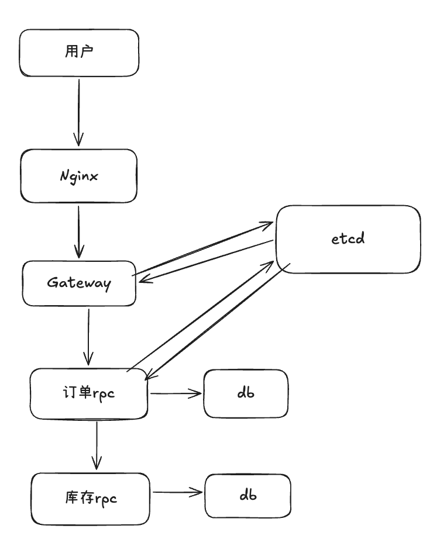
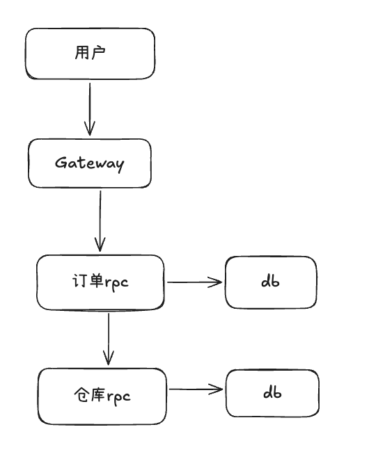
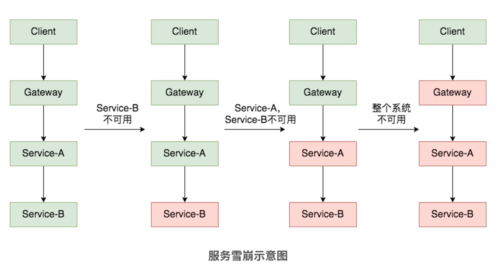
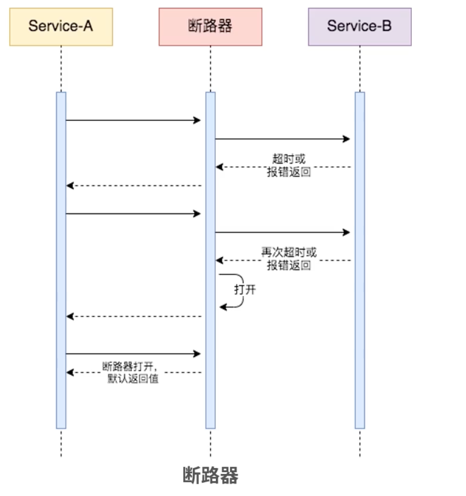
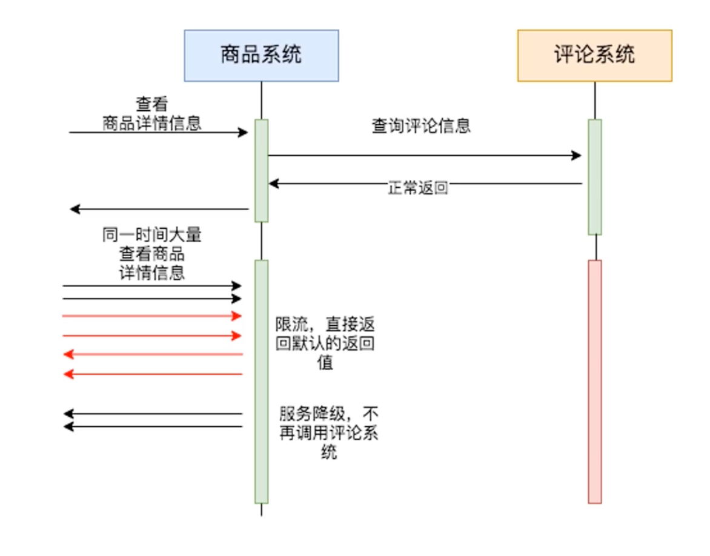

# 微服务治理

## 什么是微服务治理？

微服务治理，就是在微服务架构下，为了让大量服务能够稳定、可控、高效地协同工作，而配套的一整套机制和能力。

简单理解：

- 服务拆分之后，系统不会天然变得更好维护
- 服务变多之后，调用关系会更复杂
- 所以我们需要一套治理手段来保证系统正常运行

## 为什么需要微服务治理？

在单体应用里，大部分逻辑都在一个进程内完成，调用链路相对简单。
但到了微服务架构中，一个请求往往会经过多个服务，任何一个环节出问题，都可能影响整条链路。

比如：

- 某个服务实例宕机了
- 某个下游服务响应很慢
- 流量突然上涨
- 新版本发布后出现问题

如果没有治理能力，系统就很容易出现请求堆积、调用失败、故障扩散，甚至服务雪崩。

所以微服务治理的目标，就是让系统在面对复杂调用关系、异常情况和流量变化时，依然能够稳定运行。

## 服务治理包含哪些方面？

```text
服务治理
├── 基础能力
│   ├── 服务注册与发现
│   ├── 配置中心
│
├── 调用控制
│   ├── 负载均衡
│   ├── 超时
│   ├── 重试
│
├── 稳定性保障
│   ├── 限流
│   ├── 熔断
│   ├── 降级
│   ├── 健康检查
│
├── 可观测性
│   ├── 日志收集
│   ├── 监控，指标
│   ├── 链路追踪
│
└── 发布能力
    ├── 灰度发布
    ├── 动态路由
```

本次课程主要讲解调用控制、稳定性保障和发布能力三个方面。

## 服务注册与发现

在微服务架构里，一个服务往往会部署多个实例，而且实例的地址可能会变化。
如果把服务地址直接写死在代码里，一旦实例扩缩容、宕机、迁移机器，调用方就很难及时感知，服务之间也很难灵活通信。

### 服务注册

服务注册：服务启动后，把自己的网络地址、端口等信息注册到注册中心。

比如：

```text
order-service 启动了 3 个实例
每个实例都把自己的地址注册到 Consul
Consul 中就维护了 order-service 的实例列表
```

### 服务发现

服务发现：调用方在发起请求前，不是把目标服务地址写死，而是先去注册中心查询目标服务当前有哪些可用实例，再从中选一个去调用。

比如：

```text
gateway 要调用 order-service
它先去注册中心查 order-service
拿到一组实例地址
再结合负载均衡算法选一台发请求
```

### 常见的注册中心

- Consul
- Etcd
- Nacos
- Zookeeper

## 健康检查

服务注册与发现是让服务实例把自己的地址注册到注册中心，调用方再从注册中心拿到可用节点列表进行调用。
但“注册了”不代表“真的可用”，所以还需要健康检查。

比如一个服务实例虽然进程还活着，但：

- 接口已经卡住了
- 数据库连不上了
- Redis 挂了
- 线程或 goroutine 资源已经耗尽了

### 健康检查的方式

#### 1. HTTP 探测

```text
GET /health
```

- 返回 `200` → 健康
- 返回 `500` → 不健康

#### 2. TCP 探测

- 是否可以建立连接

#### 3. 脚本检查

- 执行自定义命令或脚本，测试数据库连接等复杂健康检查

Consul 是自带健康检查的，通过配置可以让 Consul 定期检查这个实例是否健康。
如果检查失败，这个实例虽然可能还注册着，但不会被当成健康实例返回给调用方。
调用方做服务发现时，通常拿到的是健康实例列表。


## 负载均衡

负载均衡能够将大量请求分发到多台服务器处理，尽量让流量分配更均匀，提高系统的吞吐能力和可用性。

先来看一下调用过程：

```text
用户
 ↓
Nginx（入口负载均衡）
 ↓
Gateway（业务网关）
 ↓
RPC服务1
 ↓
RPC服务2（有的rpc服务可能会调用其他rpc服务）
```

我们以电商项目中的创建订单请求来看这条线路：



### 第一层：入口负载均衡（Nginx）

- 用户发 HTTP 请求 `POST /order/create`
- Nginx 收到请求，根据配置进行负载均衡
- `Nginx → gw-1 / gw-2 / gw-3`
- 把流量分散到多个业务 Gateway，避免入口被打爆

Nginx 配置示例：

```nginx
upstream gateway_servers {
    server 127.0.0.1:8080;
    server 127.0.0.1:8081;
    server 127.0.0.1:8082;
}

server {
    listen 80;

    location / {
        proxy_pass http://gateway_servers;
        proxy_set_header Host $host;
        proxy_set_header X-Real-IP $remote_addr;
        proxy_set_header X-Forwarded-For $proxy_add_x_forwarded_for;
    }
}
```

### 第二层：服务调用负载均衡

#### 1. Gateway 调用 RPC 服务

- `gw-2` 收到 Nginx 打来的请求
- `gw-2` 除了做鉴权、限流、绑定请求等等任务，还需要调用下游 RPC 服务，此时还需要进行一次负载均衡
- `gw-2` 从注册中心获取（或本地缓存的）`order-service` 实例列表

```text
order-1
order-2
order-3
```

- 然后根据自己负载均衡的算法选择一台打过去
- 比如选中了 `order-2`，发起 RPC 调用

#### 2. 微服务之间调用

- 此时 `order-2` 收到了来自 `gw-2` 的请求
- 因为订单服务需要调用库存服务
- `order-2 → inventory-service（3台）`
- 从注册中心拿到：

```text
inv-1
inv-2
inv-3
```

- 本地做负载均衡选择：`inv-3`
- 发起 RPC 调用：`order-2 → inv-3`

### 常用的算法

#### 1. 轮询

就一个一个轮着来。

#### 2. 加权轮询

性能更强的机器分到的请求更多，反之更少。

```text
A（权重5）
B（权重3）
C（权重2）
```

10 个请求：

```text
A A A A A
B B B
C C
```

#### 3. 一致性哈希

按照某个稳定的 key（比如 userId）进行哈希，在节点集合不变时，相同的 key 通常会落到同一台机器上；当节点增减时，只有一部分请求会重新分配。

比如按照 `userId` 做哈希路由，映射到某台服务器：

```text
user 1001 → A
user 1002 → C
user 1001 → A（始终一致）
```

## 超时

超时就是：调用一个服务，等太久就不等了，直接失败返回。

### 为什么必须要有超时？

还是以电商来举例：

```text
用户请求 → gateway → order → inventory → db
```



如果：

- `inventory` 卡住了（慢 SQL / Redis 挂了）
- `order` 一直等 `inventory`
- `gateway` 一直等 `order`

但是新的请求不断打来，请求不断堆积，goroutine、连接和处理资源被大量占用，最终可能引发服务雪崩。

### 超时都包含什么？

#### 第一层：HTTP I/O 超时（入口）

- `用户 -> Gateway`
- 这一层主要是 HTTP 的读写超时
- 可以在 `hz` 配置：

```go
WithReadTimeout
WithWriteTimeout
```

- 用户发请求太慢 -> 断开
- Gateway 回响应太慢 -> 断开

#### 第二层：请求总超时

- 这一层在 Gateway 控制

```go
ctx, cancel := context.WithTimeout(ctx, 500*time.Millisecond)
defer cancel()
```

- 表示这次请求在 Gateway 这一层的总时间预算，包含 Gateway 自己的处理时间，以及调用下层rpc的时间
- 如果 `ctx` 继续向下传递，也可以进一步约束后续 RPC、DB、Redis 操作的耗时
- 如果下游 RPC 慢了，没能在时限内返回，超时后 Gateway 可以返回错误信息，或者走降级逻辑，提示用户稍后再试

#### 第三层：RPC 调用超时

- 包括 Gateway 调用 RPC 服务，RPC 调用另一个 RPC 服务
- 单次 RPC 的超时时间一般要小于整个请求的总超时时间

```go
client.WithRPCTimeout(200 * time.Millisecond)
```

- 超时后返回错误信息，最后由 Gateway 统一处理

#### 第四层：DB/Redis 超时

```go
ctx, cancel := context.WithTimeout(ctx, 100*time.Millisecond)
defer cancel()

db.WithContext(ctx).Find(...)
```

- 控制的是数据访问时间：SQL 查询、Redis 操作
- 没能在时限内完成操作就主动返回

### 一个简单的时间预算示例

```text
用户
 ↓
Gateway（500ms）
 ↓
RPC（200ms）
 ↓
DB（100ms）
```

Kitex 框架有超时控制：[Kitex Timeout](https://www.cloudwego.io/zh/docs/kitex/tutorials/service-governance/timeout/)


## 重试

重试，就是一次调用失败后，不是立刻认定请求失败，而是再发起一次或多次调用，看看能不能成功。

### 为什么需要重试？

微服务调用链长，服务之间使用网络通信，网络天然不稳定。

比如：

- TCP 包丢了
- 某个服务瞬时压力很大，来不及响应
- 注册中心刚刚切换实例

这些情况不是永久错误，而是短暂的错误，可能再发一次请求就好了，直接失败太可惜，所以会进行重试。

### 重试最重要的是什么？

重试最重要的不是怎么实现，而是明确哪些接口能重试，哪些不能。

先说一下重试适合的场景，并不是所有场景下都适合重试。

#### 适合重试的场景

- 网络抖动、连接瞬时失败
- 连接被拒绝，但服务可能马上恢复
- 短暂的 RPC 调用失败
- 有明确恢复信号的短期限流后稍后再试

这些场景的共同点是：错误通常是暂时的，过一会儿再次请求有可能成功。

#### 不适合重试的场景

- 参数错误
- 业务报错

因为这些问题不是重试就能成功的。

### 还有一些原则

- 优先对幂等性接口进行重试
- 读接口通常更适合重试
- 写接口如果做了幂等设计，并且重试不影响的情况下，也可以重试
- 如果请求可能已经成功执行，但只是响应没有及时返回，就要特别小心重试带来的重复副作用
- 只对可以恢复的错误重试，不要对确定性的业务错误重试

### 如何实现重试

参考框架自己带的重试能力：

[Kitex Retry](https://www.cloudwego.io/zh/docs/kitex/tutorials/service-governance/retry/)

### 重试方案

#### 1. 立即重试

适合偶发的网络抖动。

#### 2. 固定间隔重试

比如失败后每隔 `100ms` 重试一次，最多三次。

#### 3. 指数退避重试

```text
第一次失败，等 100ms
第二次失败，等 200ms
第三次失败，等 400ms
```

#### 4. 指数退避 + 随机抖动

```text
第一次：100ms ± 随机一点
第二次：200ms ± 随机一点
第三次：400ms ± 随机一点
```

这种方式比较好，防止大量请求在同一时间点同时重试。

### 重试的限制

- 重试必须设置最大次数
- 重试的总耗时不能超过请求的整体超时预算

### 重试的副作用

最后还是要说，重试一定不能随便加。

重试会带来很多副作用：

- 增加请求量
- 放大下游压力
- 造成重复写入
- 严重一些会带来重试风暴

重试需要与限流、熔断、超时、降级一起使用。


## 限流

限流是对系统的请求速率、并发数或资源使用进行控制，防止系统被瞬时流量压垮。

### 看这个例子

你的订单服务最多处理 `1000 QPS`，但此时来了 `10000 QPS`，如果没有限流，所有请求进入链路，导致：CPU 打满、DB 打爆、Redis 挂掉，整个服务直接崩了。

所以我们需要限流把超出的请求挡在外面。

### 限流一般有三层

```text
用户
 ↓
[网关限流]（第一道防线）
 ↓
[服务限流]（第二道防线）
 ↓
[下游资源保护]（DB）
```

#### 网关限流

- 可以在 Nginx 中配置

```nginx
limit_req_zone $binary_remote_addr zone=api_limit:10m rate=10r/s;
```

- 同时在 Gateway 中，可以实现一个限流中间件，然后挂到需要限流的接口上

#### 服务限流

- 微服务的限流，Kitex 提供了开箱即用的限流工具
- [Kitex Limiting](https://www.cloudwego.io/zh/docs/kitex/tutorials/service-governance/limiting/)

#### 下游资源限流

- 数据库连接池限制
- 控制并发量

### 限流常用算法

#### 1. 固定窗口

比如：`1s` 内最多 `100` 个请求。

实现简单，但是存在问题：

```text
0.99 秒：100 个请求
1.01 秒：100 个请求
实际 200 个，超出服务能力
```

#### 2. 滑动窗口

- 最近 `1` 秒内统计请求数进行限制
- 避免固定窗口那种情况

#### 3. 漏桶算法

```text
请求 → 桶 → 固定速率流出
```

#### 4. 令牌桶（实践中很常用）

- 系统每秒生成 `N` 个 token
- 请求来了必须拿 token
- 没有 token → 拒绝
- Go 的官方扩展库自带一个令牌桶

```go
func main() {
	// 每秒产生 2 个令牌，桶容量 5
	limiter := rate.NewLimiter(2, 5)

	for i := 0; i < 10; i++ {
		time.Sleep(200 * time.Millisecond) // 模拟请求间隔
		if limiter.Allow() {
			fmt.Println("request", i, "allowed", time.Now().Format("15:04:05.000"))
		} else {
			fmt.Println("request", i, "rejected", time.Now().Format("15:04:05.000"))
		}
	}
}
```

### 限流策略

#### 1. 按用户限流

`user_id → 100 req/s`

#### 2. 按 IP 限流

`IP → 10 req/s`

#### 3. 按接口限流

`/create_order → 50 req/s`

#### 4. 全局限流

`整个服务 → 1000 req/s`

### 分布式限流

多个服务实例共享同一套限流状态，实现全局流量控制。

实现：

- 一个常见实现方式是使用 Redis + Lua 实现分布式令牌桶

Redis 里记录两种状态：

- `tokens`：当前剩余令牌数
- `last_time`：上次补充令牌的时间

使用惰性补充的方式，只有当请求到来时，才根据当前时间和上次时间，计算这段时间应该补多少令牌。

步骤：

1. 读当前状态
2. 计算应该补多少令牌
3. 更新桶中的令牌数
4. 判断能否拿令牌
5. 把最新的状态写回 Redis

Lua 脚本示例：

```lua
local key = KEYS[1]

local rate = tonumber(ARGV[1])      -- 每秒生成多少令牌
local capacity = tonumber(ARGV[2])  -- 桶容量
local now = tonumber(ARGV[3])       -- 当前时间戳（毫秒）
local requested = tonumber(ARGV[4]) -- 本次请求需要多少令牌

local data = redis.call("HMGET", key, "tokens", "last_time")
local tokens = tonumber(data[1])
local last_time = tonumber(data[2])

if tokens == nil then
    tokens = capacity
end

if last_time == nil then
    last_time = now
end

local delta = math.max(0, now - last_time)
local filled_tokens = math.min(capacity, tokens + (delta * rate / 1000))
local allowed = filled_tokens >= requested

local new_tokens = filled_tokens
if allowed then
    new_tokens = filled_tokens - requested
end

redis.call("HMSET", key,
    "tokens", new_tokens,
    "last_time", now
)
```


## 熔断

熔断就是：当下游服务持续出问题时，调用方暂时不再继续请求它，而是直接失败或者走兜底逻辑，避免故障继续扩大。

### 来看这条链路

```text
用户请求 → gateway → order → inventory
```

如果 `inventory` 服务已经很慢，甚至大量报错，但 `order` 还是不断去调它，那么会出现：

- 请求堆积
- goroutine 和连接被占用
- 上游响应越来越慢
- 故障从一个服务扩散到整个链路
- 引发系统雪崩

服务雪崩



所以要有熔断：

当系统判断 `inventory` 已经不稳定时，先不要继续打它，避免把自己也拖垮。

### 熔断是怎么工作的？

#### 1. Closed 状态

正常状态，服务请求可以正常通过。

#### 2. Open 状态

如果在一段时间内：

- 错误率很高
- 或者连续失败次数很多
- 或者慢请求太多

那就触发熔断，后续请求直接失败，暂时不再访问下游。



#### 3. Half-Open 状态

过一段时间后，放少量请求过去试探一下：

- 如果恢复了，就关闭熔断，回到正常状态
- 如果还是失败，就继续保持熔断

### 熔断后怎么办？

- 直接返回错误
- 返回默认值
- 走降级逻辑
- 提示用户稍后再试

### 如何使用？

使用 Kitex 自带的熔断功能：
[Kitex Circuit Breaker](https://www.cloudwego.io/zh/docs/kitex/tutorials/service-governance/circuitbreaker/)
还有gobreaker
[gobreaker](https://github.com/sony/gobreaker)


## 降级

降级是指当系统压力过大、依赖服务异常、请求超时、熔断或限流触发时，系统主动或被动地关闭、简化或替换部分非核心能力，返回默认值、缓存值或简化结果，从而优先保证核心流程可用。

### 降级和熔断的区别

- 熔断：发现下游持续异常，暂时不再调用它
- 降级：主动牺牲部分非核心能力，保证核心流程可用
- 熔断是保护机制，降级是业务取舍，而且两者可以一起使用

### 常见的降级方式

#### 1. 关闭非核心功能

- 关闭商品推荐
- 关闭评论展示
- 关闭个性化展示

#### 2. 返回默认值

- 优惠券信息返回空
- 推荐列表返回空数组

#### 3. 返回缓存数据

- 商品推荐列表返回缓存
- 评论系统返回缓存

#### 4. 简化业务流程

- 下单时跳过积分计算，相似商品推荐等



### 都有哪些接口或功能适合降级

- 不是所有接口都适合降级
- 读接口更适合降级
- 写接口大多数不适合降级
- 读接口降级，最多是“少看一点、看旧一点、看粗一点”；
- 写接口降级，很容易变成“状态写不准、数据不一致、用户以为成功但其实没成功”。

比如一个电商项目中

比较适合的有：

- 商品列表
- 商品详情里的非核心附加信息
- 后台查询类接口
- 购物车页里的某些辅助展示信息
- 推荐、活动、统计类信息

不适合做降级的地方：

- 登录
- 注册
- 创建商品
- 更新商品
- 购物车写操作
- 创建订单
- 库存预占
- 库存释放
- 确认扣减
- 支付确认

使用时参考：[Kitex Fallback](https://www.cloudwego.io/zh/docs/kitex/tutorials/service-governance/fallback/)


灰度发布

## 灰度发布

灰度发布就是：新版本不是一次性让所有用户都访问到，而是先让一小部分流量进入新版本，观察是否正常，再逐步扩大范围，最后全量发布。

### 为什么要灰度发布？

如果一个新版本有 bug，而你直接全量上线，那影响的是所有用户。
如果先只放 `5%` 或 `10%` 的流量进去，即使有问题，影响范围也会小很多，也更容易及时回滚。

### 常见的灰度方式

#### 按流量比例灰度

比如 `5%` 请求进入新版本，`95%` 仍然走老版本。

#### 按用户灰度

比如只让内部员工、测试账号、部分白名单用户先看到新版本。

#### 按请求特征灰度

比如按地区、设备类型、请求头、Cookie、用户 ID 来决定是否进入新版本。

灰度发布通常需要靠动态路由来实现。
动态路由是能力，灰度发布是这个能力的一个典型应用场景。

## 动态路由

动态路由：系统可以根据配置、规则或者请求特征，把请求实时转发到不同的服务实例、版本或集群，而不需要改代码重新发布。

### 常见的动态路由方式

#### 按用户路由

比如指定用户 ID、白名单用户走新版本。

#### 按请求头路由

比如请求头里带某个标记，就转发到灰度环境。

#### 按地域路由

比如华东流量走华东机房，华北流量走华北机房。

#### 按版本路由

比如一部分请求走 `v1`，另一部分走 `v2`。

### 一个简单例子

比如订单服务有两个版本：

```text
order-v1
order-v2
```

此时可以配置规则：

- 普通用户默认走 `order-v1`
- 内部测试用户走 `order-v2`

这样就不用改业务代码，只需要改路由规则，就能把流量导向不同版本。

灰度发布通常需要靠动态路由来实现。
动态路由是能力，灰度发布是这个能力的一个典型应用场景。


# 作业
本次课以概念为主，大家课后好好消化一下
- lesson11让大家做了一个登录注册demo，大家可以继续完善，给这个小demo增加一些新功能，然后根据本节课学的服务治理，使用一些你认为可以使用的治理。希望大家在最终考核的时候加上服务治理的内容。

- 学有余力的同学自己了解一下隔离以及本节课没有讲的其他治理

- 本次作业不需要提交